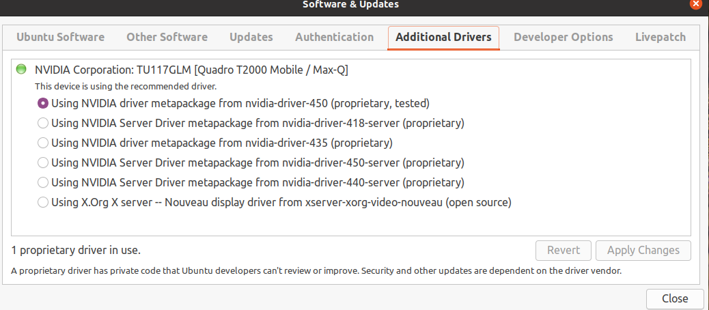

# Linux

Notes on installing and setting up Linux distributions.


- [General usage](#general-usage)
  * [File renames](#file-renames)
  * [find](#find)
  * [wget](#wget)
  * [mount, fdisk and lsusb](#mount--fdisk-and-lsusb)
  * [usb drives](#usb-drives)
  * [du (Disk usage)](#du--disk-usage-)
  * [cron](#cron)
    + [Editing crontab](#editing-crontab)
    + [Monitor crontab](#monitor-crontab)
  * [pass](#pass)
  * [Job management, e.g. pgrep](#job-management--eg-pgrep)
  * [Text processing and pipes](#text-processing-and-pipes)
  * [Shell script examples](#shell-script-examples)
  * [openssh](#openssh)
  * [postman](#p)
  * [screen](#screen)
  * [watch](#watch)
  * [top and mpstat](#top)
  * [ip addresses](#ip-addresses)
  * [grep and pdfgrep](#grep-and-pdfgrep)
  * [tar archives](#tar-archives)
- [Ubuntu install](#ubuntu-install)
  * [Installing 20.04 LTS](#installing-2004-lts)
  * [Device details](#device-details)
  * [inittab](#inittab)
  * [To redo install](#to-redo-install)
  * [Adding drive to automount](#adding-drive-to-automount)
  * [Software Management](#software-management)
  * [Video drivers](#video-drivers)
  * [Monitors](#monitors)
  * [Grub](#grub)
  * [Ghostscript (kind of)](#ghostscript--kind-of-)
  * [Upgrade rollback](#upgrade-rollback)
  * [nteract](#nteract)
  * [Firefox](#firefox)
  * [wget](#wget-1)
  * [MS Teams](#ms-teams)
  * [Email](#email)
  * [Zoom](#zoom)
  * [VIM](#vim)
  * [KeepassXC](#keepassxc)
  * [Network monitoring](#network-monitoring)
  * [Diff/Merge/FTP](#diff-merge-ftp)
  * [SSH](#ssh)
  * [Video/audio capture](#video-audio-capture)
  * [Webcam Video Camera](#webcam-video-camera)
  * [Virtualisation](#virtualisation)
- [Manjaro install](#manjaro-install)
  * [Hardware details](#hardware-details)
  * [Hardware](#hardware)
  * [pacman](#pacman)
  * [Pacman tips](#pacman-tips)
  * [Yay](#yay)
  * [Hamster time tracker](#hamster-time-tracker)
  * [R](#r)
  * [Python](#python)
  * [Email](#email-1)
  * [Zoom](#zoom-1)
  * [Neovim](#neovim)
  * [Winmerge alternative](#winmerge-alternative)
  * [Keepassxc](#keepassxc)
  * [Video drivers](#video-drivers-1)
  * [Video capture](#video-capture)
  * [Kernel status modules.](#kernel-status-modules)
  * [Audio](#audio)
  * [Network access](#network-access)
  * [NVIDIA](#nvidia)
  * [Phoronix bench tests](#phoronix-bench-tests)
  * [Panel plugins](#panel-plugins)
  * [Chrome](#chrome)
  * [Sublime text 3](#sublime-text-3)
  * [Install R from command line to local folder](#install-r-from-command-line-to-local-folder)
  * [JAGS](#jags)
  * [atom](#atom)
  * [XFCE things](#xfce-things)


## General usage

### File renames

```
for f in *.txt; do 
    mv -- "$f" "${f%.txt}.text"
done
```

### find

```
# all files modified since:
find . -type f -newermt 2020-11-19
# pdfs accessed in last 3 days
find . -iname "*.pdf" -atime -3 -type f
# modified in the last 24 hours
find . -iname "*.pdf" -mtime 0 -type d
```

### wget

```
# Mirror
wget --recursive --no-parent --continue --no-clobber https://urlOfInterest
# All files of type
wget ‐‐level=1 ‐‐recursive ‐‐no-parent ‐‐accept mp3,MP3 http://example.com/mp3/
# Single file
wget https://test.org/latest.zip

# All files of type
wget --spider -r --accept "*.docx" 
# List of urls
wget ‐‐input list-of-file-urls.txt

```

### mount, fdisk and lsusb

Useful commants

```
sudo lsusb
sudo fdisk -l
# mkdir /home/fred/media
sudo mount /dev/sda1 /home/fred/media
sudo umount /home/fred/media
```

Create a director in your home directory and mount

```
mkdir /home/fred/usb
sudo mount /dev/deviceid /home/fred/usb
```

Umount

```
sudo umount /home/fred/usb
```

### usb drives

Ask - what usb devices can my box see?

```
sudo lsusb
```

What devices?

```
sudo fdisk -l
```

### du (Disk usage)

Size of directory and contents

```
du -sh /home/myfatdir
# breakdown
du -shc /home/myfatdir/*
```

### cron 

`cron` is a task scheduler.
Cron jobs are managed via the `crontab`.
Each user can have their own crontab.

Set to run in the background:

```
$ sudo systemctl enable cron
Synchronizing state of cron.service with SysV service script with /lib/systemd/systemd-sysv-install.
Executing: /lib/systemd/systemd-sysv-install enable cron
```

```sh
$ sudo systemctl status cron
cron.service - Regular background program processing daemon
     Loaded: loaded (/lib/systemd/system/cron.service; enabled; vendor preset: enabled)
     Active: active (running) since Wed 2021-03-24 14:49:36 AWST; 3 days ago
       Docs: man:cron(8)
   Main PID: 962 (cron)
      Tasks: 1 (limit: 76891)
     Memory: 10.8M
     CGroup: /system.slice/cron.service
             └─962 /usr/sbin/cron -f

Mar 28 11:30:01 blink CRON[303807]: pam_unix(cron:session): session opened for user root by (uid=0)
etc
```


#### Editing crontab

```
$ crontab -e
```

Edit to add jobs, example:

```
# run every minute
*/1 * * * * /usr/bin/Rscript /home/test/spot.R
# run every day at 30th minute of 2nd hour
30 2 * * * /usr/bin/Rscript /home/test/spot.R
```

#### Monitor crontab

```sh
$ tail -f /var/log/syslog
```

### pass

This is a command line password manager. 
However, to use it, you need to set up [GPG](gpg.md)  . 
To initialise a new store:

```
pass init email
# add a password - automatically created a 10 character password
# will output what the password is:
pass generate test 10
# review the passwords in the store
pass
```
typing `pass test` will prompt you for the gpg passphrase then show you the requested password. if you use `pass -c test` the password will be copied to the clipboard for 45 seconds. remove the password using `pass rm test` 

### Job management, e.g. pgrep

Very useful for killing a number of instances of the same application, e.g. 

```
for pid in $(pgrep R); do kill -9 $pid; done
```

Start a job in the background piping to stdout and stderr to file.

```
./run_sim_3.sh > logs/test.log 2>&1 &
```
### Text processing and pipes

Can be used for extracting columns, seeing the number of words in a file and selecting unique entries from a file respectively.

```
cut -d , -f 2 fname.txt
wc -l fname.txt | sort -n
uniq fname.txt

# use all 3!!
cut -d , -f 2 animals.txt | sort | uniq
```

### Shell script examples

Simple script processing a few command line args.

```
# Select lines from the middle of a file.
# Usage: bash middle.sh filename end_line num_lines
head -n "$2" "$1" | tail -n "$3"
```

Use the `"$@"` command to say that all command line arguments passed in should be used.

```
# Sort filenames by their length.
# Usage: bash sorted.sh one_or_more_filenames
wc -l "$@" | sort -n
```

Redo the last 4 commands in the history.

```
history | tail -5 | cut -d " " -f 2 | head -4
```

Wordcount on files identified with `find`:

```
wc -l $(find . -name "asterix.dat") | sort -n 
```

Find all files from current dir and sort them by date/time

```
find . your-options -printf "%T+\t%p\n" | sort
```

Find all files of a specified type in a given dir then grep them for a term

```
find . -type f -name '*.R' -print0 | xargs -0 grep -o 'new.env()'
```


Invoke command on other machine when your command has quotes within quotes:

```
ssh username@machinename "sh -c 'R CMD REMOVE '\''rstanmodels'\'' &'"

ssh username@machinename "sh -c 'R CMD INSTALL --preclean rstanmodels'"
```

### openssh

`sshd`, `sftp` and other things. 
After diligently updating `/etc/ssh/sshd_config` use the following to control the status of the ssh demon.

```
# this has the sshd running continually - bad
sudo systemctl enable sshd.service

# so change it:
sudo systemctl disable sshd.service

# manual start is 
sudo systemctl start sshd.service

# and stop with
sudo systemctl stop sshd.service

# check status
sudo systemctl status sshd.service
```

On the client do

```
ssh -p portnum user@ipaddr
```


### postman

An API development platform, see resources [here](https://learning.postman.com/).
Frustratingly, more things seem to need to be installed with snap, which often seems to be very slow.

```
sudo snap install postman
```

You have to create an account.

### screen

Linux Screen allows you to:

+ Use multiple shell windows from a single SSH session.
+ Keep a shell active even through network disruptions.
+ Disconnect and re-connect to a shell sessions from multiple locations.
+ Run a long running process without maintaining an active shell session.

Note that to scroll up in `screen` you need to invoke `ctl A` then hit escape, then use the arrow keys (up and down) or page up/down. When you are done hit escape again.

Commands:

```
# create a screen session
screen             
# detach current screen session
Ctrl a + d   
# reattach latest screen session
screen -RR         
# list all screen sessions
screen -ls          
# reattach session
screen -R <session id (from screen -ls)>   
# kill all
ctrl a + \
```

### watch

```
watch -n 3 ls -l logs/ out/
```

### top

CPU utilisation can be monitored with `top` or `htop`. 
For AMD, `mpstat` is more detailed and `nmon` is another alternative, see [http://nmon.sourceforge.net/pmwiki.php]

```
sudo apt install sysstat
# report utilisation on all cpus
mpstat -P 0-
sudo apt install nmon
nmon
```

### ip addresses

Don't use `ifconfig` use `ip` e.g. 

```
ip a
```

use `iw dev` to get the wifi mac address.

### grep and pdfgrep

Recursive from current directory, only *.R files.

`grep -R --include="*.R" 'contr.sum' .`

Find text in pdfs recursively from the current directory:

`pdfgrep -r arm .`

### tar archives

```
tar cvf archive.tar dir1 dir2 etc
gzip archive.tar

# hash
sha256sum archive.tar.gz

# table of contents
tar -tf archive.tar

# for fat32
split -b 2000M archive.tar.gz archive_part

# join back together
cat archive_part* > test.tar.gz

# hash
sha256sum test.tar.gz

# delete some files from the archive
tar -vf yourArchive.tar --delete your/path/to/delete
```


## Ubuntu install

### Installing 20.04 LTS

https://www.youtube.com/watch?v=n8VwTYU0Mec

Boot log is stored at `/var/log/boot.log` and `/var/log/dmesg` (kernel ring buffer) and to view use `dmesg | less` (`q` to exit). 
Alternatively, if you are in the UI, do special key and then type logs to run the Logs app.

Other useful logs (some might be binary) include:

+ `/var/log/auth.log` authorisation 
+ `/var/log/daemon.log` daemons (ssh etc)
+ `/var/log/debug`
+ `/var/log/kern.log`
+ `/var/log/syslog` if you cannot find it anywhere else, it will probably be in here `man syslogd`
+ `/var/log/Xorg.0.log` your favourite and mine
+ `/var/log/faillog` login failures
+ `/var/log/wtmp` user info, but just use `who`

### Device details

Use list hardware `lshw`, for example, computer model:

```
sudo lshw | grep product
```

### inittab

Is no longer with us. 
To switch run level use

```
systemctl get-default
 
 # Set the current run level to 3 (boot to command line mode)
systemctl set-default multi-user.target
 
 # Set the current running level to 5 (power on as a graphical interface)
systemctl set-default graphical.target
```

### To redo install
create liveusb
Press F12? to go to boot screen
boot the live install
run the installer (select free driver)


### Adding drive to automount

Identify the device (disk) you want to mount with `sudo fdisk -l` (gives you the `/dev/blah`) then get its universal id with `sudo blkid` (gives you the id e.g. `UUID="123a-321b"`).  

Create a mount point `sudo mkdir /data` and update grouop ownership:  

```
sudo groupadd data
sudo usermod -aG data USERNAME (Where USERNAME is the name of the user to be added)
sudo chown -R :data /data
```

Add the following to the end of `/etc/fstab` (note the id is from the dummy example above):

```
UUID=123a-321b /data    auto nosuid,nodev,nofail,x-gvfs-show 0 0
```

The flags indicate:

+ `UUID=123a-321b` is the UUID of the drive
+ `/data` is the mount point for the device.
+ `auto` automatically mounts the partition at boot 
+ `nosuid` the filesystem cannot contain set userid files. This prevents root escalation and other security issues.
+ `nodev` the filesystem cannot contain special devices (to prevent access to random device hardware).
+ `nofail` removes the errorcheck.
+ `x-gvfs-show` show the mount option in the file manager
+ `0` determines which filesystems need to be dumped (0 is the default).
+ `0` determine the order in which filesystem checks are done at boot time (0 is the default).

Finally, test with `sudo mount -a`.  
If there are no errors and you can access the mount point then you should be fine to reboot.


### Software Management

`apt` gives a simplified interface compared to `apt-get` etc.


|apt command     |	the command it replaces	|function of the command                                  |
|----------------|--------------------------|---------------------------------------------------------|
|apt install	   | apt-get install	        | Installs a package                                      |
|apt remove	     |apt-get remove	          | Removes a package                                       |
|apt purge	     |apt-get purge	            | Removes package with configuration                      |
|apt update	     |apt-get update	          | Refreshes repository index                              |
|apt upgrade	   |apt-get upgrade	          | Upgrades all upgradable packages                        |
|apt autoremove	 |  apt-get autoremove	    | Removes unwanted packages                               |
|apt full-upgrade|	apt-get dist-upgrade	  | Upgrades packages with auto-handling of dependencies    |
|apt search	     |apt-cache search	        | Searches for the program                                |
|apt show	       |apt-cache show	          | Shows package details                                   |
|apt list --installed | ? | Shows all the installed packages |

Examples:

```
# update repos
sudo apt update
# upgrade apps to lastest repos version
sudo apt upgrade
sudo apt remove apache2 vim
sudo apt-get --purge remove gimp
# also remove config
sudo apt purge apache2
sudo apt search apache2
sudo apt list --installed
# dependency
sudo apt show apache2
sudo apt depends apache2
# upgrade a single package
sudo apt install apache2
```

Package description https://packages.ubuntu.com/focal/

```
# update file list (then upgrade if necessary)
sudo apt update

# to install .deb files with their dependencies
sudo apt -y install gdebi-core

# e.g.  but note there are also other ways to do this
sudo gdebi rstudio-1.2.5019-amd64.deb

```


### Video drivers

This is without doubt the most hassle you will get from linux.
Often blue screen of death relates to nvidia drivers. 
Upgrades of the drivers will result in things like external monitors not working and even entire system not booting.

Current drivers:



Various links of interest

https://askubuntu.com/questions/882385/dev-sda1-clean-this-message-appears-after-i-startup-my-laptop-then-it-w  
https://linoxide.com/linux-how-to/how-to-install-nvidia-driver-on-ubuntu/  
https://sourcedigit.com/25531-install-nvidia-graphics-driver-on-ubuntu-20-04/  

Note comment on grub update  
https://askubuntu.com/questions/1059965/internal-laptop-screen-not-detected-when-using-nvidia-driver  


If you need to do a boot to terminal, do, Alt-F2 then login to terminal.

```
# Graphics card and drivers
sudo hwinfo --gfxcard --short
```

This will give a brief report of the card and driver:

```
lspci -k | grep -A 2 -i "VGA"
01:00.0 VGA compatible controller: NVIDIA Corporation TU117GLM [Quadro T2000 Mobile / Max-Q] (rev a1)
	Subsystem: Dell TU117GLM [Quadro T2000 Mobile / Max-Q]
	Kernel driver in use: nvidia
```

The following gives more detail.

```
nvidia-smi

Sat Nov 14 13:55:58 2020       
+-----------------------------------------------------------------------------+
| NVIDIA-SMI 450.80.02    Driver Version: 450.80.02    CUDA Version: 11.0     |
|-------------------------------+----------------------+----------------------+
| GPU  Name        Persistence-M| Bus-Id        Disp.A | Volatile Uncorr. ECC |
| Fan  Temp  Perf  Pwr:Usage/Cap|         Memory-Usage | GPU-Util  Compute M. |
|                               |                      |               MIG M. |
|===============================+======================+======================|
|   0  Quadro T2000        Off  | 00000000:01:00.0  On |                  N/A |
| N/A   47C    P8     6W /  N/A |    461MiB /  3903MiB |      9%      Default |
|                               |                      |                  N/A |
+-------------------------------+----------------------+----------------------+
                                                                               
+-----------------------------------------------------------------------------+
| Processes:                                                                  |
|  GPU   GI   CI        PID   Type   Process name                  GPU Memory |
|        ID   ID                                                   Usage      |
|=============================================================================|
|    0   N/A  N/A      1092      G   /usr/lib/xorg/Xorg                161MiB |
|    0   N/A  N/A      1657      G   /usr/lib/xorg/Xorg                123MiB |
|    0   N/A  N/A      1784      G   /usr/bin/gnome-shell              109MiB |
|    0   N/A  N/A      2294      G   ...AAAAAAAAA= --shared-files       57MiB |
+-----------------------------------------------------------------------------+

# Previously was
Wed Sep 30 10:56:30 2020       
+-----------------------------------------------------------------------------+
| NVIDIA-SMI 450.66       Driver Version: 450.66       CUDA Version: 11.0     |
|-------------------------------+----------------------+----------------------+
| GPU  Name        Persistence-M| Bus-Id        Disp.A | Volatile Uncorr. ECC |
| Fan  Temp  Perf  Pwr:Usage/Cap|         Memory-Usage | GPU-Util  Compute M. |
|                               |                      |               MIG M. |
|===============================+======================+======================|
|   0  Quadro T2000        Off  | 00000000:01:00.0  On |                  N/A |
| N/A   50C    P0    15W /  N/A |    400MiB /  3903MiB |      3%      Default |
|                               |                      |                  N/A |
+-------------------------------+----------------------+----------------------+
                                                                               
+-----------------------------------------------------------------------------+
| Processes:                                                                  |
|  GPU   GI   CI        PID   Type   Process name                  GPU Memory |
|        ID   ID                                                   Usage      |
|=============================================================================|
|    0   N/A  N/A      1089      G   /usr/lib/xorg/Xorg                 39MiB |
|    0   N/A  N/A      1640      G   /usr/lib/xorg/Xorg                168MiB |
|    0   N/A  N/A      1768      G   /usr/bin/gnome-shell              143MiB |
|    0   N/A  N/A      4538      G   ...AAAAAAAAA= --shared-files       40MiB |
+-----------------------------------------------------------------------------+


# Previously was
+-----------------------------------------------------------------------------+
| NVIDIA-SMI 440.100      Driver Version: 440.100      CUDA Version: 10.2     |
|-------------------------------+----------------------+----------------------+
| GPU  Name        Persistence-M| Bus-Id        Disp.A | Volatile Uncorr. ECC |
| Fan  Temp  Perf  Pwr:Usage/Cap|         Memory-Usage | GPU-Util  Compute M. |
|===============================+======================+======================|
|   0  Quadro T2000        Off  | 00000000:01:00.0  On |                  N/A |
| N/A   35C    P8     6W /  N/A |    479MiB /  3903MiB |      2%      Default |
+-------------------------------+----------------------+----------------------+
                                                                               
+-----------------------------------------------------------------------------+
| Processes:                                                       GPU Memory |
|  GPU       PID   Type   Process name                             Usage      |
|=============================================================================|
|    0      1035      G   /usr/lib/xorg/Xorg                           161MiB |
|    0      1614      G   /usr/lib/xorg/Xorg                           125MiB |
|    0      1819      G   /usr/bin/gnome-shell                         113MiB |
|    0      2117      G   ...6454/.local/share/hiri_1.4.0.5/hirimain    22MiB |
|    0      2274      G   ...6454/.local/share/hiri_1.4.0.5/hirimain     1MiB |
|    0      2299      G   ...AAAAAAAAAAAACAAAAAAAAAA= --shared-files    44MiB |
+-----------------------------------------------------------------------------+
```


```
# suggest recommended drivers
sudo ubuntu-drivers devices
# e.g.
sudo apt install nvidia-driver-440
sudo shutdown -r now
# and pray

# switch primary card
sudo prime-select query # sept 2020 gives nvidia
sudo prime-select intel
sudo prime-select nvidia
sudo apt list --installed | grep nvid

# remove nvidia
sudo apt-get purge nvidia*
# default installs
sudo ubuntu-drivers autoinstall

# in gnome
nvidia-settings
```

Restarting X with `pkill X`


Now we see the Quadro T2000 running off the nvidia driver (look below at `configuration: driver=nvidia`

```
sudo lshw -c display
  *-display                 
       description: VGA compatible controller
       product: TU117GLM [Quadro T2000 Mobile / Max-Q]
       vendor: NVIDIA Corporation
       physical id: 0
       bus info: pci@0000:01:00.0
       version: a1
       width: 64 bits
       clock: 33MHz
       capabilities: pm msi pciexpress vga_controller bus_master cap_list rom
       configuration: driver=nvidia latency=0
       resources: irq:205 memory:b4000000-b4ffffff memory:70000000-7fffffff memory:80000000-81ffffff ioport:3000(size=128) memory:b5000000-b507ffff
  *-display
       description: VGA compatible controller
       product: UHD Graphics 630 (Mobile)
       vendor: Intel Corporation
       physical id: 2
       bus info: pci@0000:00:02.0
       version: 02
       width: 64 bits
       clock: 33MHz
       capabilities: pciexpress msi pm vga_controller bus_master cap_list rom
       configuration: driver=i915 latency=0
       resources: irq:203 memory:b3000000-b3ffffff memory:60000000-6fffffff ioport:4000(size=64) memory:c0000-dffff

```


```
# kernel module status
lsmod | grep video
uvcvideo               98304  0
videobuf2_vmalloc      20480  1 uvcvideo
videobuf2_memops       20480  1 videobuf2_vmalloc
videobuf2_v4l2         24576  1 uvcvideo
videobuf2_common       49152  2 videobuf2_v4l2,uvcvideo
videodev              225280  3 videobuf2_v4l2,uvcvideo,videobuf2_common
mc                     53248  4 videodev,videobuf2_v4l2,uvcvideo,videobuf2_common
video                  49152  2 dell_wmi,dell_laptop
```


### Monitors

Sometimes the external monitor works but the laptop screen doesn't.
Sometimes the reverse is true.
Why?
Honestly, I do not really know but the following details a few tips found in forums etc.

`~/.config/monitor.xml` can occassionally get munted.  
Delete the above file, disconnect external, restart, replug external.  

Note default display manager (lightdm, gdm3 etc) from `cat /etc/X11/default-display-manager`

Open the file in your favorite editor (vim, nano, gedit, etc.).

```
sudo nano /lib/modprobe.d/nvidia-kms.conf
```

And comment out the the nvidia-drm modeset option.

```
# This file was generated by nvidia-prime
# Set value to 0 to disable modesetting
# options nvidia-drm modeset=1
```

### Grub

Grub is the bootloader; the thing that starts up your system.
To get rid of the quiet splashscreen so that everything is output while loading:

```
# in /etc/default/grub
GRUB_CMDLINE_LINUX_DEFAULT="nomodeset"
sudo update-grub2
sudo shutdown -r now
```

https://www.dedoimedo.com/computers/grub-2.html

### Ghostscript (kind of)

`ps2pdf` is obtained via tinytex but my understanding is that this is just a wrapper to gs  
You can specify an output size as `ps2pdf -g5950x8420 kalman4.ps`

This https://stackoverflow.com/questions/30128250/ps2pdf-preserve-page-size is useful.

### Upgrade rollback 

**WARNING:** Fraught. Do not proceed unless absolutely necessary.

```
grep -A 2 'Start-Date: 2020-09-30' /var/log/apt/history.log
```
https://www.cyberciti.biz/howto/debian-linux/ubuntu-linux-rollback-an-apt-get-upgrade/

### nteract

A desktop application that allows you to run notebooks.  

```
wget https://github.com/nteract/nteract/releases/download/v0.24.1/nteract_0.24.1_amd64.deb
sudo gdebi nteract_0.24.1_amd64.deb
```

Now open the Julia REPL and type `]` then add the `IJulia` package with `add IJulia`. 
Enter `Ctl-C`  to exit the `pkg` manager.
Find nteract in your applications and launch.

### Firefox

Completely uninstall. 

```
sudo apt-get purge firefox
rm -rf .mozilla/firefox/
sudo rm -rf /etc/firefox/
sudo rm -rf /usr/lib/firefox/
sudo rm -rf /usr/lib/firefox-addons/
```

### wget 

Examples see https://www.gnu.org/software/wget/manual/html_node/Examples.html 

```
# Retrieve the first two levels of ‘wuarchive.wustl.edu’, saving them to /tmp.
wget -r -l2 -P/tmp http://www.example.com/dir/
# You want to download all the pdfs from a directory on an HTTP server. 
wget -r -l1 --no-parent -A.pdf http://www.example.com/dir/
```

### MS Teams

Download the deb package from the link to link below then rather than use `dpkg` use:

```
# for deb packages
sudo apt install gdebi-core
sudo gdebi skype.deb
```

https://www.howtoforge.com/how-to-install-microsoft-teams-linux-on-ubuntu-and-centos/

### Email

Have now resorted to using office outlook online.

Alternatively use evolution, or hiri, or mailspring (if you can stand it) or thunderbird in conjunction with DavMail, see:

https://www.youtube.com/watch?v=yCEK2hNP7bg

or Hiri (proprietary) via snap.

related links:

https://www.zimbra.com/email-server-software/email-outlook-sync-mapi-zco/  
https://zentyal.com/community/  

### Zoom

Use sso to login (uni-sydney).
Note, there is something wrong with the sound drivers on my system.
However, when I use wireless headphone/mic setup, that works ok.
Urgh.
Sometimes it is easier to use `zoom`, `teams` etc via a VM, see Virtualbox.

### VIM

Use neovim instead `sudo apt install neovim`. Nb `nvim` to execute.

### KeepassXC

Open source version of KeePass. Cross platform. Can import Keepass db.

### Network monitoring

```
sudo apt install bmon
sudo apt install slurm
sudo apt tcptrack
sudo apt vnstat
```

https://www.tecmint.com/linux-network-bandwidth-monitoring-tools/

### Diff/Merge/FTP

```
sudo apt install meld
sudo apt install filezilla
```

### SSH

Tools for converting a ppk from win box format to ssh key. 

**NOTE** 
When specifying a port `scp` uses a capital `-P` whereas `ssh uses a small `-p`. Urgh.

```
sudo apt-get install putty-tools
# convert priv - here you need to use the passphrase associated with the ppk file. 
# if you need to create a ppk file:
puttygen -t rsa -C "my home key" -o mykey.ppk
# if you do not have it, you are stuffed.
puttygen id_dsa.ppk -O private-openssh -o id_dsa
puttygen id_dsa.ppk -O public-openssh -o id_dsa.pub
# agent running?
eval "$(ssh-agent -s)"
ssh-add ~/.ssh/id_dsa
# use passphrase from original to get in
# then just
ssh -p portnum usernamem@199.19.19.1
```

or do it from scratch: https://support.pawsey.org.au/documentation/display/US/Logging+in+with+SSH

To copy files across, you can use `scp`, e.g.

```
scp -P 1234 file.tar ubuntu@1.2.3.4:/home/userdir
```

### Video audio capture

```
sudo apt install guvcview
sudo apt install audacity
sudo apt install vlc
```

## Webcam Video Camera

If the mic stops working execute:

```
modprobe snd-usb-audio
```

see last post here https://www.pclinuxos.com/forum/index.php?topic=152015.0


Useful applications and tweaks (see https://www.youtube.com/watch?v=DaZ9zU3tdFY)

```
sudo apt install v4l-utils
# but then use
$ v4l2-ctl # application to control video4linux drivers
# list devices
$ v4l2-ctl --list-devices
Integrated_Webcam_HD: Integrate (usb-0000:00:14.0-11):
	/dev/video0
	/dev/video1
	/dev/video2
	/dev/video3
	/dev/media0
	/dev/media1
# /dev/video0 is the main game
# These are the options you can set
$ v4l2-ctl -d /dev/video0 --list-ctrls
                     brightness 0x00980900 (int)    : min=-64 max=64 step=1 default=0 value=0
                       contrast 0x00980901 (int)    : min=0 max=95 step=1 default=0 value=0
                     saturation 0x00980902 (int)    : min=0 max=100 step=1 default=64 value=64
                            hue 0x00980903 (int)    : min=-2000 max=2000 step=1 default=0 value=0
 white_balance_temperature_auto 0x0098090c (bool)   : default=1 value=1
                          gamma 0x00980910 (int)    : min=100 max=300 step=1 default=100 value=100
                           gain 0x00980913 (int)    : min=1 max=8 step=1 default=1 value=1
           power_line_frequency 0x00980918 (menu)   : min=0 max=2 default=2 value=1
      white_balance_temperature 0x0098091a (int)    : min=2800 max=6500 step=1 default=4600 value=4600 flags=inactive
                      sharpness 0x0098091b (int)    : min=1 max=7 step=1 default=2 value=2
         backlight_compensation 0x0098091c (int)    : min=0 max=3 step=1 default=3 value=3
                  exposure_auto 0x009a0901 (menu)   : min=0 max=3 default=3 value=3
              exposure_absolute 0x009a0902 (int)    : min=10 max=626 step=1 default=156 value=156 flags=inactive
# For example - powerline frequency is set to 
$ v4l2-ctl -d /dev/video0 --get-ctrl=power_line_frequency
power_line_frequency: 1  
# Which is 50Hz. If you set it to 60Hz (and you are not in a 50Hz region, e.g. aus) you will see wavy lines on the image.    
# To set a value do, for example:
$ v4l2-ctl -d /dev/video0 --set-ctrl=power_line_frequency=2   
# To see all the attribute data for the device do
$ udevadm info --attribute-walk --name=/dev/video0
# To make this persistent across reboots (see from 6:40 mins in video) create file 
# sudo vim /etc/udev/rules.d/99-logitech.rules
# and add content (the various attributes are obtained from the output to udevadm call earlier
SUBSYSTEM=="video4linux", KERNEL=="video[0-9*", ATTRS{product}=="HD Pro Webcam C920", ATTRS{serial}=="E1C05EAF", RUN="/usr/bin/v4l2-ctl -d $devnode --set-ctrl=power_line_frequency=1"
```

also of note:

```
hardinfo
guvcview # video camera config - similar to v4l2ucp (sourceforge)
cheese # for taking pics etc - also see fswebcam
```


### Virtualisation

Virtual box.

https://www.youtube.com/watch?v=2oO9CeZXjTY

short version:

https://www.youtube.com/watch?v=eon_NdNfqqg

If everything has gone to plan, you will be prompted on clicking Device -> Insert guest additions to download.  
Download, then insert the iso as a cd then install the guest additions on the virtual windows box.

```
sudo apt search virtualbox
sudo apt install virtualbox-ext-pack
```

If you forget to install the extension pack (like I did) then your webcam (for example) won't work in your virtual machine. 
To rectify this, start your windows vm, then in the linux terminal do:

```
# The the webcam devices, the integrated cam in a laptop will be the first
VBoxManage list webcams
# Then add the webcam to the vm
VBoxManage controlvm "win10_or_whatever_you_called_your_vm" webcam attach /dev/vid123 
```

The windows OS should register the webcam and set it up for you and after that you will be able to use the webcam on the vm.


## Manjaro install

NOTE:

Turns out that arch can be a bit of a nightmare due to a `rstan` dependency on `V8`.  
`rstan` needs the `V8` lib but `V8` doesn't currently compile without manual intervention.
Doh.

For a related discussion see https://discourse.mc-stan.org/t/dangerous-design-in-rstan-2-21/16483

Going with minimal with xfce: `manjaro-xfce-20.0.3-minimal-200606-linux56.iso`.
Also tried gnome `manjaro-gnome-20.0.3-minimal-200606-linux56.iso` but did not like.

Install updates to bring you up to date.
Make sure to `sudo pacman -Syu base-devel` to finish off.
Remember, `dmesg | grep blah` `dmesg | tail -20` are your friends.

```
sudo dmesg --level=err,warn
# timestamps
dmesg -T
```

Also, `modprobe` for adding/removing modules from kernel.


### Hardware details

```
sudo pacman -S hardinfo

sudo dmidecode

sudo dmidecode --type memory


cat /proc/cpuinfo
cat /proc/cpuinfo | grep processor | wc -l
lscpu

sudo pacman -S i-nex libcpuid
```

### Hardware

Intel Xeon Silver 4110 LGA3647 2.1GHz 8-Core CPU Processor
SKU# AC08317, Model# BX806734110


### pacman 

`pacman` https://wiki.manjaro.org/index.php?title=Pacman_Tips

Note `checkupdates` provides a safe way to check for upgrades to installed packages without running a system update at the same time.

Never install a package without updating the system first.

| command                        | desc                                       |
|--------------------------------|--------------------------------------------|
|pacman -Sy                      | download fresh copy of master package db   |
|pacman -Syu pkg                 |	Install (and update package list)         |
|pacman -S pkg                   |	Install only                              |
|pacman -R pkg                   |	Uninstall pkg                             |
|pacman -Rsu pkg                 |	Uninstall pkg and unneeded dep            |
|pacman -Ss keywords	           | Search                                     |
|pacman -Syu	                   | Upgrade everything                         |
|pacman -Qdt                     | list orphan pkgs not used by anything else |
|sudo pacman -Rs $(pacman -Qdtq) | remove all the orphans                     |
|sudo pacman -Sc                 | clear out cache                            |
|pactree -U package              | dependencies                               |
|pactree -r package              | dep                                        |
|pacman -Qe	                     | List explictly-installed packages          |
|pacman -Ql pkg	                 | What files does this package have?         |
|pacman -Qii pkg	               | List information on package                |
|pacman -Qo file	               |  Who owns this file?                       |
|pacman -Qs query	               | Search installed packages for keywords     |
|pacman -Q --info pkg            | get info on installed package              |


Also

```
# update to closest mirror and update system
sudo pacman-mirrors --geoip  && sudo pacman -Syyu

# for local files
sudo pacman -U /var/cache/pacman/pkg/smplayer-19.5.0-1-x86_64.pkg.tar.xz
```

Urgh, install additional package manger `yay` to get to Arch User Repository.  
Commands pretty much as per `pacman`

```
sudo pacman -Syu yay
```


### Pacman tips

https://wiki.manjaro.org/index.php?title=Pacman_Tips

```
# first:
# run checkupdates, which is included with the pacman, provides a safe way 
# to check for upgrades to installed packages without running a system 
# update at the same time
checkupdates

# update to closest mirror and update system
sudo pacman-mirrors --geoip  && sudo pacman -Syyu
# search
pacman -Ss pkg_name 
# download fresh copy of master package db 
pacman -Sy
# install a package
pacman -S pkg_name
# upgrade 
pacman -Su
# remove 
pacman -R package_name

# update the package database and update all packages on the system
sudo pacman -Syu

# dependencies
pactree -U package
pactree -r package

```

Use https://www.archlinux.org/mirrorlist/ to generate new list of mirrors.


### Yay

https://www.ostechnix.com/yay-found-yet-another-reliable-aur-helper/

```
sudo pacman -S yay
# Uninstall package (although you can just use pacman -R)
yay -Rns pkgname
```


### Hamster time tracker

`sudo pacman -S hamster-time-tracker`


### R

Libs:
```
yay -Syu v8

```

```
sudo pacman -Syu gcc-fortran
# use faster openblas - need to install prior to install r
sudo pacman -Syu openblas
sudo pacman -Syu r
yay -Syu rstudio-desktop
# select 1 rstudio-desktop
```

Now `rstudio` will probably not show windows due to a `qt` issue.  
Solution at bottom of thread here: https://forum.manjaro.org/t/rstudio-gui-broken-after-update/120635/8

```
sudo vi /usr/lib/qt/libexec/qt.conf
# add and then save and try rstudio again:
[Paths]
Prefix = /usr/lib/qt
Data = /usr/share/qt
Translations = /usr/share/qt/translations
```


### Python

Don't bother with `spyder` etc; more hassle than it is worth.

### Email

See around 8:15 mins for config (under gnome) at https://www.youtube.com/watch?v=yCEK2hNP7bg  
It looks like EWS is dead so not sure that access via DavMail etc is going to work regardless of app.  
Install `hiri` works with full calendar integration; no idea how.

### Zoom

Note comments on mic for zoom https://aur.archlinux.org/packages/zoom/

### Neovim

```
sudo pacman -Syu neovim
```

### Winmerge alternative

Use `meld`

### Keepassxc

```
sudo pacman -Syu keepassxc
```

### Video drivers

The standard guide is here:
https://wiki.manjaro.org/index.php?title=Configure_NVIDIA_(non-free)_settings_and_load_them_on_Startup

also relevant https://wiki.archlinux.org/index.php/NVIDIA_Optimus

Note the summary here:
https://forum.manjaro.org/t/howto-set-up-prime-with-nvidia-proprietary-driver/40225

If you can deal with it then the simplest approach is to turn off the internal gpu via the uefi and to power the output ports by the gpu.  

Specifically, note the 'in short' text here:  
http://www.daknetworks.com/blog/453-dell-precision-7720-graphics

The NVIDIA guide:  
http://us.download.nvidia.com/XFree86/Linux-x86/370.28/README/index.html

Useful commands

```
# install screen configurator
sudo pacman -Syu xorg-xrandr
# List configs
xrandr
# driver
mhwd -li
# system desc
inxi -Fxxxza
inxi -G
hwinfo --display --monitor

xrandr --listproviders 
xrandr --prop
pacman -Qs | grep -Ei 'prime|nvidia|optimus|bbsw|vesa|xf86-video'
ls -laR /etc/X11 ; cat /etc/X11/xorg.conf.d/*.conf
ls -la /etc/modprobe.d ; cat /etc/modprobe.d/*.conf
ls -la /etc/modules-load.d ; cat /etc/modules-load.d/*.conf
ls -la /usr/share/X11/xorg.conf.d ; grep -v /usr/share/X11/xorg.conf.d/*.conf
```

Default res on external 3840 x 2160 16:9. Pick something more sensible e.g. 1920  x 1080.

### Video capture 

First, a simple tool to test things:

```
sudo pacman -Syu guvcview

# alt using vlc, should open web cam and audio capture:
vlc v4l2:// :input-slave=alsa:// :v4l-vdev="/dev/video0"
```

```
v4l2-ctl --list-devices

# to get detail on the actual cam - what you can modify:
v4l2-ctl -d /dev/video0 --list-ctrls
                     brightness 0x00980900 (int)    : min=-64 max=64 step=1 default=0 value=0
                       contrast 0x00980901 (int)    : min=0 max=95 step=1 default=0 value=0
                     saturation 0x00980902 (int)    : min=0 max=100 step=1 default=64 value=64
                            hue 0x00980903 (int)    : min=-2000 max=2000 step=1 default=0 value=0
 white_balance_temperature_auto 0x0098090c (bool)   : default=1 value=1
                          gamma 0x00980910 (int)    : min=100 max=300 step=1 default=100 value=100
                           gain 0x00980913 (int)    : min=1 max=8 step=1 default=1 value=1
           power_line_frequency 0x00980918 (menu)   : min=0 max=2 default=2 value=2
      white_balance_temperature 0x0098091a (int)    : min=2800 max=6500 step=1 default=4600 value=4600 flags=inactive
                      sharpness 0x0098091b (int)    : min=1 max=7 step=1 default=2 value=2
         backlight_compensation 0x0098091c (int)    : min=0 max=3 step=1 default=3 value=3
                  exposure_auto 0x009a0901 (menu)   : min=0 max=3 default=3 value=3
              exposure_absolute 0x009a0902 (int)    : min=10 max=626 step=1 default=156 value=156 flags=inactive
```


### Kernel status modules.  

The `uvcvideo` is a kernel driver module meant to support any usb video class compliant device.

```
lsmod | grep uvcvideo
```


ffmpeg seems like a bit of a nightmare as a bundle of utilities but probably worth having some familiarity with.

http://www.ffmpeg.org/

and

https://wiki.archlinux.org/index.php/FFmpeg#Recording_webcam

some translation of options for ffmpeg http://4youngpadawans.com/stream-camera-video-and-audio-with-ffmpeg/


### Audio

Dated but may be useful https://download.nvidia.com/XFree86/gpu-hdmi-audio-document/  

Also, earlier zoom link https://aur.archlinux.org/packages/zoom/

```
# show cards and devices
pactl list cards & pacmd list-sinks
# launch pulseaudio mixer 
alsamixer
# f6 to select card (intel is the Realtek ALC289) set mic as reqd then 
sudo alsactl store
# Note that alsamixer PCM = Pulse Code Modulation. This is where all sound is 
# sent to (I think). Review (selecting the appropriate card num):
amixer --card 0

# list all mics
arecord -l
# card 0: PCH [HDA Intel PCH], device 0: ALC289 Analog [ALC289 Analog]
# Subdevices: 0/1
# Subdevice #0: subdevice #0

# arecord and aplay for command line record and play
```

Aside - sound recording via audacity `sudo pacman -Syu audacity`


### Network access 

For accessing pawsey etc.

SSH
Tools for converting ppk from win box to ssh key.

```
sudo pacman -Syu putty
# convert priv - you will need to enter the keynim for the original .ppk file
puttygen id_dsa.ppk -O private-openssh -o id_dsa
puttygen id_dsa.ppk -O public-openssh -o id_dsa.pub
# agent running?
eval "$(ssh-agent -s)"
# you will need to use the passphrase again
ssh-add ~/.ssh/id_dsa
# then just
ssh -p 22 usernamem@199.19.19.1
```

or do it from scratch: https://support.pawsey.org.au/documentation/display/US/Logging+in+with+SSH

### NVIDIA

You need to have done the install using the free drivers.
Edit grub (/etc/default/grub) then `sudo update-grub` as per dorian dot slash then go to [https://wiki.manjaro.org/index.php?title=Configure_NVIDIA_(non-free)\_settings_and_load_them_on_Startup and follow instructions]

### Phoronix bench tests

`yay -S phoronix-test-suite`

### Panel plugins

```
yay -S xfce4-hardware-monitor-plugin
yay -S xfce4-datetime-plugin
```

### Chrome

`yay -S google-chrome`

### Sublime text 3

https://www.sublimetext.com/docs/3/linux_repositories.html

### Install R from command line to local folder

Update 2020-03-26:

The approach (https://forum.manjaro.org/t/using-the-statistical-package-r-in-manjaro-with-rstudio/484)
seems to work just fine. 
The following is retained for posterity.

```
The easiest way to do this is to install R from source:

$ wget http://cran.rstudio.com/src/base/R-3/R-3.4.1.tar.gz
$ tar xvf R-3.4.1.tar.gz
$ cd R-3.4.1
$ ./configure --prefix=$HOME/myr
$ make && make install
```

The configure part is very important. 
It specifies the directory you will install to.

Next you might want to specify where your packages are installed. 
I create a `.Rprofile` file with the line `.libPaths("/home/me/myrlib/3.6")`.

```
sudo pacman -S r
yay -S rstudio-desktop-bin
# multicore support
yay -S openblas-lapack
sudo pacman -S pandoc
sudo pacman -S pandoc-citeproc
```

### JAGS

yay -S jags

### atom

I think I had to uninstall language-r and then let lintr install it as a dependency.

Also note:
https://jstaf.github.io/2018/03/25/atom-ide.html

```
yay -S atom
yay -S apm
apm install ide-r language-r
sed -i '0,/Grep/{s/Grep/Grep 2/}' ~/.atom/packages/language-r/snippets/language-r.cson
sed -i '0,/Cummulative max/{s/Cummulative max/Cummulative max 2/}' ~/.atom/packages/language-r/snippets/language-r.cson
apm install language-markdown
apm install atom-ide-ui ide-python
apm install block-select
apm install column-select
```

### XFCE things

Switch workspace `ctl alt left/right arrow`

